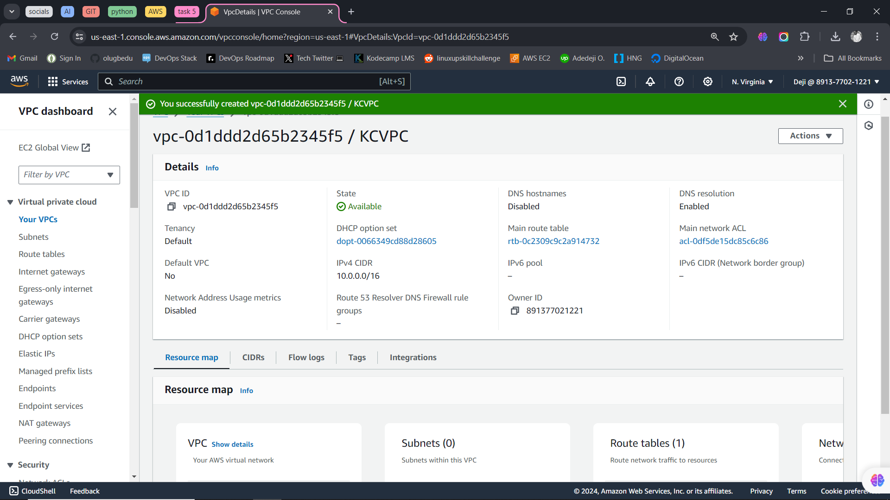
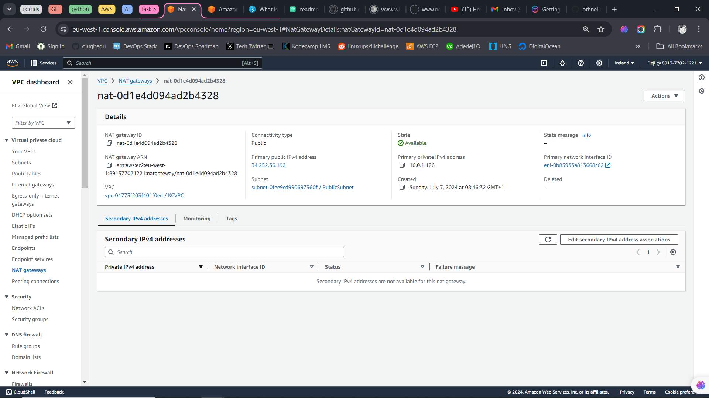
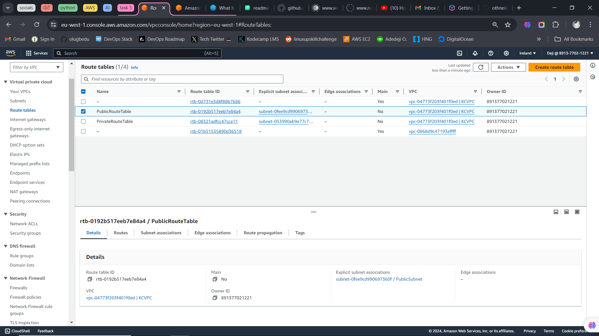
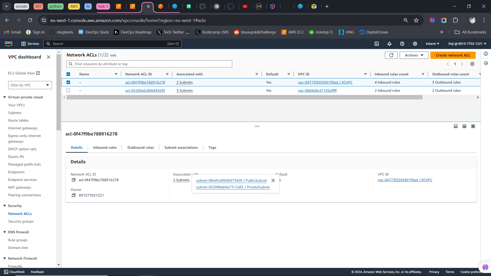
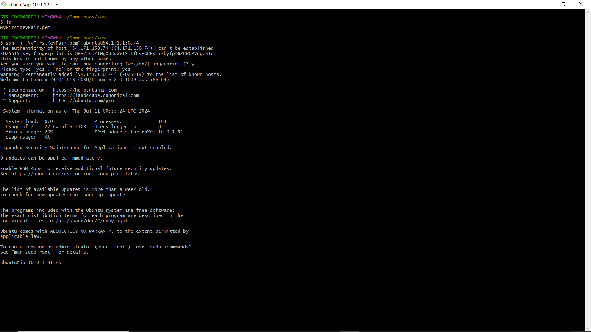

# Task 5

## A detailed report with screenshots of each step.
This is a breakdown of the steps I took to set up a Virtual Private Cloud (VPC) with both public and private subnets. Implement routing, security groups, and network access control lists (NACLs) to ensure proper communication and security within the VPC.

### Create a VPC:
I created a vpc named KCVPC and gave it IPv4 CIDR block (10.0.0.0/16)

### Create Subnets:
I created a public subnet and a private subnet giving each IPv4 CIDR block 10.0.1.0/24 and 10.0.2.0/24 respectively

### Configure an Internet Gateway (IGW):
I created an internet gateway and attached it to KCVPC . 

### Configure NAT Gateway:
I create a NAT Gateway in the public subnet and allocated an Elastic IP for the NAT Gateway.

### Configure Route Tables:
I configured the public route table, associated it with public subnet and added the route to internet(IGW 0.0.0.0/0). Then, I configured the private route table, associated it with private subnet and addded nat gateway to ensure no direct route to internet(NAT 0.0.0.0/0).

### Set Up Security Groups:
I created a Security Group for public instances, I named it PublicSG and allowed the following protocols;
- Inbound HTTP (port 80) and HTTPS (port 443) traffic from anywhere (0.0.0.0/0).
- Inbound SSH (port 22) traffic from my local IP 
- All outbound traffic.
Then i created a Security Group for private instances, I named it PrivateSG and allowed the following protocols;
- Inbound traffic from the PublicSubnet on required ports (MySQL port 3306).
- All outbound traffic.

### Network ACLs:
I configured NACLs for additional security on both subnets.
- Public Subnet NACL: Allow inbound HTTP, HTTPS, and SSH traffic. Allow outbound traffic.
- Private Subnet NACL: Allow inbound traffic from the public subnet. Allow outbound traffic to the public subnet and internet.

### Deploy Instances:
I launched an EC2 instance in the Public Subnet. Using the public security group, I connected with ssh client.
I also launched an EC2 instance in the Private Subnet, using the private security group.

## A diagram of the VPC architecture, showing the VPC, subnets, route tables, and security configurations.

## A brief explanation of the purpose and function of each component created (VPC, subnets, IGW, NAT Gateway, route tables, security groups, NACLs).

- VPC (Virtual Private Cloud): is a private network in the AWS cloud. it launches AWS resources in a virtual network that is set up and controlled.
- Subnets: 
    - Public subnet is used to host resources that need to be accessed from the internet.
    - Private Subnet is used to host resources that should stay private and not be accessible from the internet.

- Internet Gateway (IGW) is used to give internet access to instances in the public subnet. Acts as a doorway between the VPC and the internet, allowing communication in and out.

- NAT Gateway is used to let instances in the private subnet access the internet securely. Enables outbound internet traffic from instances in the private subnet while preventing unsolicited inbound connections.

- Public Route Tables is used to direct traffic from the public subnet to the internet. It contains rules that route internet-bound traffic through the IGW.
- Private Route Table is used to direct traffic from the private subnet to the NAT Gateway. It contains rules that route internet-bound traffic through the NAT Gateway.

- Security Groups is used to control inbound and outbound traffic for instances.

- Network ACLs (NACLs) is used to add an extra layer of security for subnets.

## Summary - These components all work together to create a secure, efficient, and scalable network environment in AWS.
