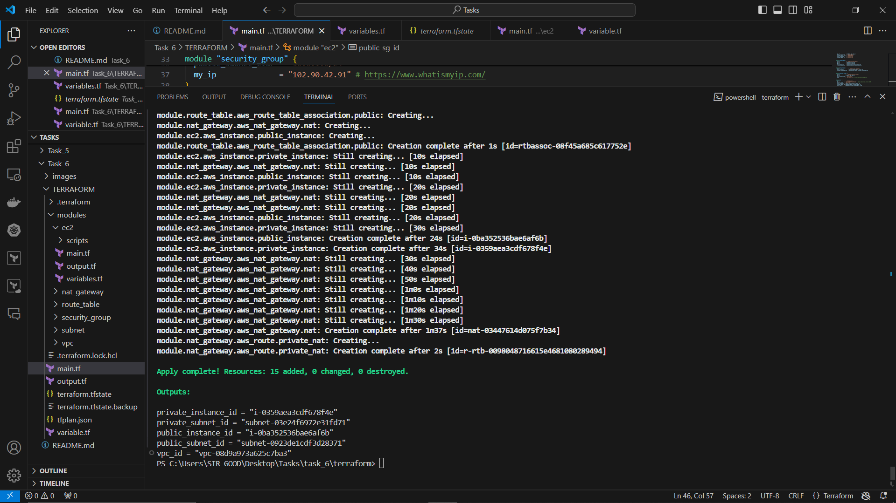
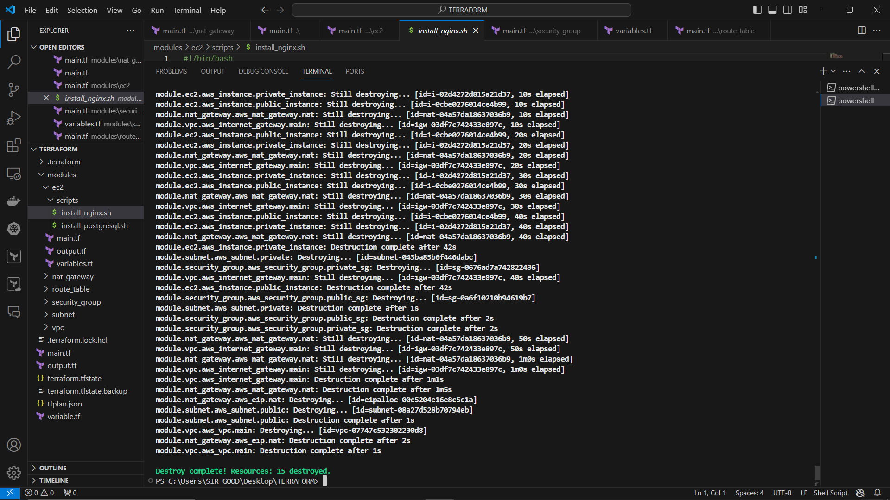

# Task 6 - Infrastructure as Code (Terraform)

## A detailed report with screenshots of each step.
This is a breakdown of the steps I took to set up a Virtual Private Cloud (VPC) with both public and private subnets. Implement routing, security groups, and network access control lists (NACLs) to ensure proper communication and security within the VPC, using TERRAFORM.

### Breakdown
#### AWS configure
- I started by configuring aws cli from my VSCODE terminal

### **modules/scripts for ec2, vpc, subnet, nat_gateway, route_table, security_group.**

#### Ec2 module:   
I used a `Terraform data block` to attach a keypair already on my console to the instances, `Terraform resource block` to create the instances (public and private), `user_data` to set the path for the ngix installation  

#### VPC module: 
I created a vpc module including the internet gateway configuration using the `Terraform resource block`

#### Subnets module: 
I created public and private subnets using the `Terraform resource block`

#### NAT Gateway module: 
I created a NAT Gateway in the public subnet and allocated an Elastic IP for the NAT Gateway, using `Terraform resource block`.

#### Route Tables module: 
I configured the public route table, associated it with public subnet and added the route to internet(IGW 0.0.0.0/0). Then, I configured the private route table, associated it with private subnet and addded nat gateway to ensure no direct route to internet(NAT 0.0.0.0/0).

#### Security Groups module: 
Using `Terraform resource block`  I created a Security Group for public instances, I named it PublicSecurityGroup and allowed the following protocols;
- Inbound HTTP (port 80) 
- HTTPS (port 443) traffic from anywhere (0.0.0.0/0).
- Inbound SSH (port 22) traffic from my local IP 
- All outbound traffic.
Then i created a Security Group for private instances, I named it PrivateSecurityGroup and allowed the following protocols;
- Inbound traffic from the PublicSubnet on required ports (MySQL port 3306).
- All outbound traffic.

#### Resource Map:

#### Terraform Appply:
 

#### Terraform Destroy:

## Output of terraform plan:  

## Summary - These components all work together to create a secure, efficient, and scalable network environment on AWS using Terraform(Infrasttucture as Code).